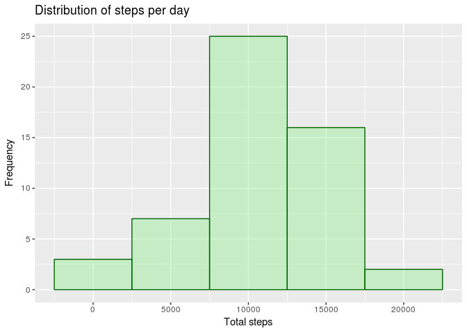
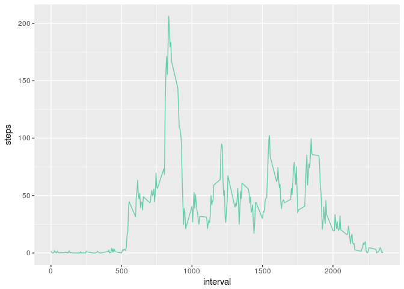
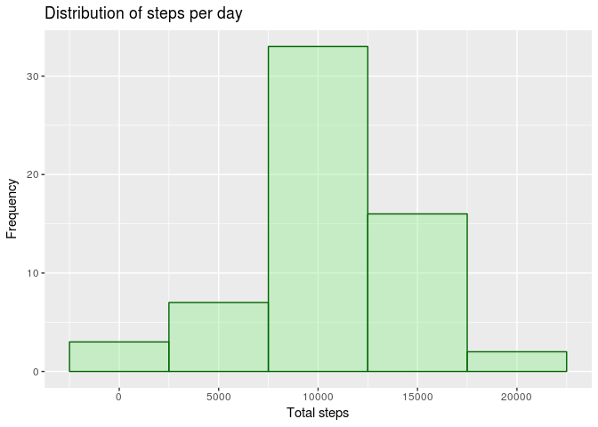
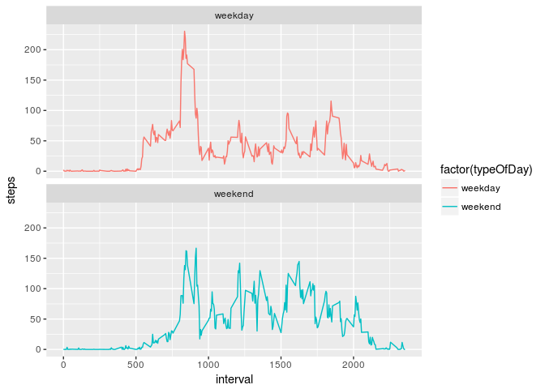

# Reproducible Research: Peer Assessment 1


## Loading and preprocessing the data

#### unzip the dataset

```r
if(!dir.exists('./data')) {
  dir.create('./data')
}

if(!file.exists('data/activity.csv')) {
  unzip('activity.zip', exdir = './data')
}
```

#### Load the data into activity variable

```r
activity <- read.csv('./data/activity.csv')
activityWoNA <- na.omit(activity)
```

## What is mean total number of steps taken per day?

Aggregate sum of steps per days and calculate mean and median

```r
stepsPerDay <- aggregate(steps~date, data = activityWoNA, FUN = sum)
stepsPerDayMean <- mean(stepsPerDay$steps)
stepsPerDayMedian <-  median(stepsPerDay$steps)
```

Make a function to create the histogram

```r
library("ggplot2")
makeHistogram <- function(data) {
  stepsPerDayPlot <- ggplot(data = data, aes(x=steps))
  stepsPerDayPlot + geom_histogram(binwidth = 5000,colour="darkgreen", fill="lightgreen",alpha=0.4) +
                    ggtitle("Distribution of steps per day") + ylab("Frequency") + xlab("Total steps")
}
```

Histogram with ggplot2

```r
makeHistogram(stepsPerDay)
```



The *mean* is 1.0766189\times 10^{4} and the *Median* is 10765

## What is the average daily activity pattern?

aggregate data by intervals

```r
meanStepsPerIntervals <- aggregate(steps~interval, data=activityWoNA, FUN = mean)
meanStepsIntervalsPlot <- ggplot(data=meanStepsPerIntervals, aes(x=interval,y=steps))
meanStepsIntervalsPlot+geom_line(color="#66cdaa")
```



```r
intervalWithMax <- meanStepsPerIntervals[which.max(meanStepsPerIntervals$steps),]$interval
```

The **interval** with *max mean* steps is **835**

## Imputing missing values

1. Get the total missing values

```r
totalMissingValues <- activity$steps[is.na(activity$steps)]
```

There are **2304** missing values.

2-3. Replace missing values with the mean in a new dataset

```r
activityNARep <- merge(activity, meanStepsPerIntervals, by="interval")
activityNARep$steps.x[is.na(activityNARep$steps.x)] <- activityNARep$steps.y[is.na(activityNARep$steps.x)]
activityNARep$steps <- activityNARep$steps.x
activityNARep <- activityNARep[,c("interval", "date", "steps")]
```

4. Make a Histogram report

```r
stepsPerDayNARep <- aggregate(steps~date, data = activityNARep, FUN = sum)
makeHistogram(stepsPerDayNARep)
```



The *mean* is 1.0766189\times 10^{4} and the *Median* is 1.0766189\times 10^{4}

## Are there differences in activity patterns between weekdays and weekends?

Add a column with label *weekday*  and *weekend* and aggregate the mean value per interval and the new column.
Produce a graph faceted by the new column (typeOfDay).

```r
activityNARep$typeOfDay <- ifelse(weekdays(as.Date(activityNARep$date,"%Y-%m-%d")) %in% c("dimanche", "samedi"), "weekend", "weekday")
stepsIntervalPerTypeOfDay <- aggregate(steps~interval+typeOfDay, activityNARep, FUN=mean)
weekDaysPlot <- ggplot(stepsIntervalPerTypeOfDay, aes(x=interval, y=steps, colour=factor(typeOfDay)))
weekDaysPlot + geom_line() + facet_wrap(~ typeOfDay, ncol=1)
```


